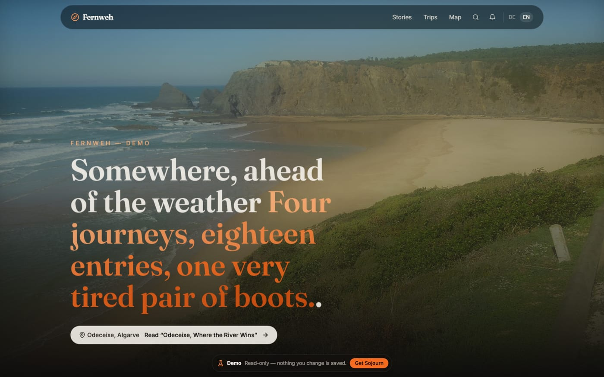
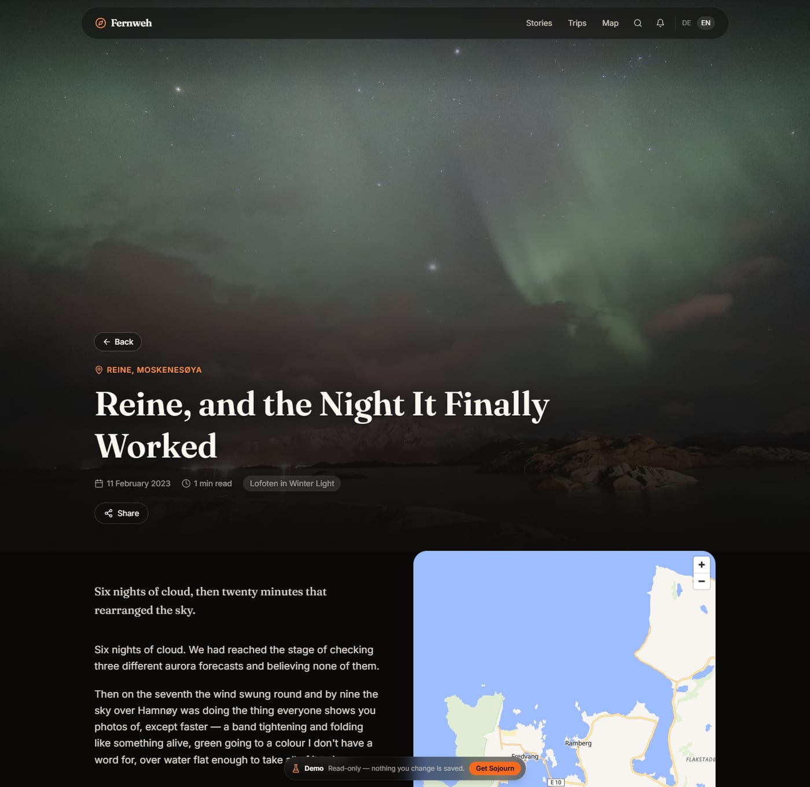
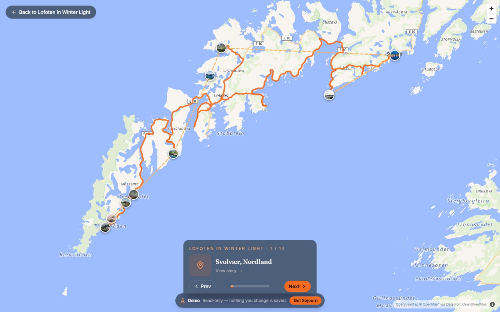

# Sojourn

**A bold, immersive travel journal.** Sojourn is a self-hostable blog/journal for documenting your travels — full-bleed hero imagery, interactive maps with route lines, photo galleries with a lightbox, reactions, comments, and full-text search. It's built to feel like a magazine and run like a single, portable container.



### [→ Try the live demo](https://sojourn-demo.vercel.app)

Four invented journeys, eighteen entries, real routes on real roads. **No sign-up:
press “Explore the demo” on [the admin login](https://sojourn-demo.vercel.app/admin/login)
and you're inside the editor** — every screen, with the content already there.

The demo is read-only, so it stays as the last person found it. Everything else
works: browse the maps and galleries, react to an entry, vote in a poll.

> **Where this is: v0.1.** I run it for my own journal and it works, but it is
> young. Expect schema churn between releases (migrations apply themselves, so
> that mostly means "redeploy"), expect rough edges away from the paths I use
> daily, and read the release notes before updating. Issues and PRs welcome.

## Features

- **Immersive home / hero** with cinematic layout and motion.
- **Post pages** with photo gallery + lightbox and scroll-driven story maps.
- **Interactive trip maps** (MapLibre GL, keyless via OpenFreeMap) with pins, route lines, and a full-screen journey explorer.
- **GPX tracks** with distance + elevation profiles.
- **Reactions** — heart, fire, wow, star.
- **Comments** with replies, likes, and an admin **moderation** surface.
- **Interactive blocks** — inline polls and quizzes inside posts.
- **Full-text search** across posts.
- **`/trips` and `/map`** index views.
- **Admin dashboard** (`/admin`) — create/edit trips & posts, a rich editor, direct **photo upload** (with EXIF/GPS extraction), and per-trip **collaborators**.
- **AI authoring** (optional) — staged drafting pipeline, photo enrichment/captioning, with a token-cost meter.
- **Internationalization** — German default with a DE/EN switcher across the whole UI.
- **Web Push notifications** for the admin and subscribers.
- **Installable PWA** — offline caching of visited pages and assets, add-to-home-screen.
- **Portable by design** — Dockerized, no vendor lock-in.

### What it looks like



*Entries pair the writing with a map that follows along as you read.*



*Every trip also opens as a route you can walk through, stop by stop.*

## Installing it

Sojourn needs one thing to run: **Supabase** (Postgres + Auth + Storage) — either
your own or theirs. Everything beyond that — web push, AI authoring, semantic
search, photo vision — is **optional** and switches on when you add the relevant
key. Nothing is locked to a single cloud vendor.

There are three ways to run it. They differ only in who looks after the database:

| | Pick this if | What it costs you |
| --- | --- | --- |
| **[All-in-one](docs/deployment.md#all-in-one--sojourn-and-its-own-supabase)** | you want a blog and would rather not think about the rest | one host, ~1 GB of RAM, no accounts anywhere |
| **[Vercel + hosted Supabase](docs/deployment.md#vercel)** | you'd rather not run a server at all | two free-tier accounts, a deploy button |
| **[Docker + your own Supabase](docs/deployment.md#docker--vps)** | you already have a Postgres/Supabase you like | one container, ~1 GB of RAM |

The shortest of the three, in full:

```bash
node scripts/selfhost-init.mjs
```

That mints this instance's Postgres password, JWT secret and API keys into
`.env.selfhost` — per-instance, never to be committed or copied from anywhere.
Open it, set `SUPABASE_PUBLIC_URL` and `SITE_URL` for your host, then:

```bash
docker compose -f docker-compose.all-in-one.yml --env-file .env.selfhost up -d
```

Six containers come up in order, the schema is created from nothing, and
`/admin` offers to create your owner account. **[Full instructions, and the two
settings worth getting right →](docs/deployment.md#all-in-one--sojourn-and-its-own-supabase)**

## First run

Open the site. While it is unclaimed, **every page** redirects to
**`/admin/setup`**, where you name your site, pick an email and password, and
land signed in as its owner. There is nothing to seed and no default password:
the first account is the one you create.

> **Claim it before you point a domain at it.** The first visitor to a fresh
> install becomes its owner, and newly issued TLS certificates are published
> publicly (Certificate Transparency), so a custom domain is discoverable within
> minutes. Claiming on the plain host or `*.vercel.app` URL first avoids the race
> entirely. As a backstop the claim only stays open for **60 minutes** — see
> [the claim window](docs/deployment.md#the-claim-window) if you miss it, which
> is recoverable.

Sojourn has exactly two kinds of account: you, and members you add. Readers never
need one — all content is public-read, shared by URL.

## Keeping it running

**Updating** is the same two commands you started with, and the database keeps up
by itself — schema migrations apply at container start, so there is no second
step:

```bash
docker compose pull && docker compose up -d
```

Pin how much change you take unattended with `SOJOURN_TAG` — `0.2.1`, `0.2`, `v0`
or the default `latest`. Sojourn also tells you when a release is out, under
**Settings → Updates**.

**Backing up** is two commands, and both halves travel together, because a
database dump without the photographs is an archive of captions:

```bash
sh scripts/backup.sh backups
```

That writes one dated `.tar.gz` holding the full database dump — every schema,
including your logins — the photo files, and a manifest saying what it contains.
Put it somewhere that is not this machine. **[Restoring, and how to test a
restore before you need one →](docs/deployment.md#backups)**

## What Sojourn sends anywhere

**Nothing, by default.** No analytics, no error reporting, no phoning home — not
to Vercel, not to Sentry, not to the people who wrote it. A fresh install talks
to your Supabase project, your map tile provider, and nobody else.

Three switches turn parts of that on, each independently, each yours:
`NEXT_PUBLIC_ANALYTICS`, `NEXT_PUBLIC_SENTRY_DSN` (your readers' browsers) and
`SENTRY_DSN` (your server). Leave one unset and the corresponding library is
never even downloaded — not loaded-but-inert, absent.
**[The detail, and why the two Sentry switches are separate →](docs/configuration.md#telemetry)**

## Documentation

- **[Deployment](docs/deployment.md)** — the three install paths in full, hosted Supabase setup, the claim window, backups, moving to a VPS later.
- **[Configuration](docs/configuration.md)** — every environment variable, what turns each optional feature on, AI provider setup, web push, telemetry.
- **[Development](docs/development.md)** — running it locally, the tech stack, project layout, how the data layer and migrations fit together.
- **[Security policy](SECURITY.md)** · **[Contributing](CONTRIBUTING.md)**

## Roadmap

Built and working, but room to grow:

- **`hreflang` for the bilingual site** — the rest of discoverability is done; this one is blocked on language living in the URL rather than a cookie, which is a design decision rather than a missing tag.
- **Share surface** — dynamic per-post Open Graph images and a native share sheet.

> Several earlier roadmap items — direct **photo upload**, a **comment moderation**
> UI, **rich Markdown** post bodies, **AI authoring**, **collaborators**, **i18n**,
> **map clustering**, and **`sitemap.xml` / `robots.txt` / JSON-LD** — are now
> implemented and listed under [Features](#features).

## License

Copyright © 2026 Philipp Gergen.

Sojourn is free software: you can redistribute it and/or modify it under the terms
of the GNU Affero General Public License as published by the Free Software
Foundation, version 3 — see **[LICENSE](LICENSE)** (`AGPL-3.0-only`). It is
distributed in the hope that it will be useful, but WITHOUT ANY WARRANTY; without
even the implied warranty of MERCHANTABILITY or FITNESS FOR A PARTICULAR PURPOSE.

- **Self-host it freely, forever.** Run it for yourself or anyone else, and modify it however you like.
- **Offering it as a service?** Also fine — the AGPL simply requires making the source of your modified version available to the people who use it.
- **Want white-label use, closed modifications, or different terms?** Commercial licenses are available — contact Philipp Gergen: <philipp.gergen@web.de>.

Contributions are welcome under a lightweight DCO + relicensing grant — see [CONTRIBUTING.md](CONTRIBUTING.md). The "Sojourn" name and logo are not covered by the code license.

**Running a modified version?** AGPL §13 requires you to offer your users the source
of the version they are actually using. The footer carries that link, and it is
runtime configuration rather than something baked into the build — point
`SOURCE_URL` at your own repository and every deployment of your image says so:

```bash
SOURCE_URL=https://git.example.org/you/sojourn
```

Unmodified deployments need do nothing; it already points at this repository.

**Third-party code.** Sojourn bundles other people's work — MapLibre GL JS, React,
Next.js and some 370 more — each under its own terms, reproduced in
[THIRD-PARTY-NOTICES.txt](THIRD-PARTY-NOTICES.txt). The Docker image additionally
embeds LGPL-3.0 libvips by way of `sharp`.
